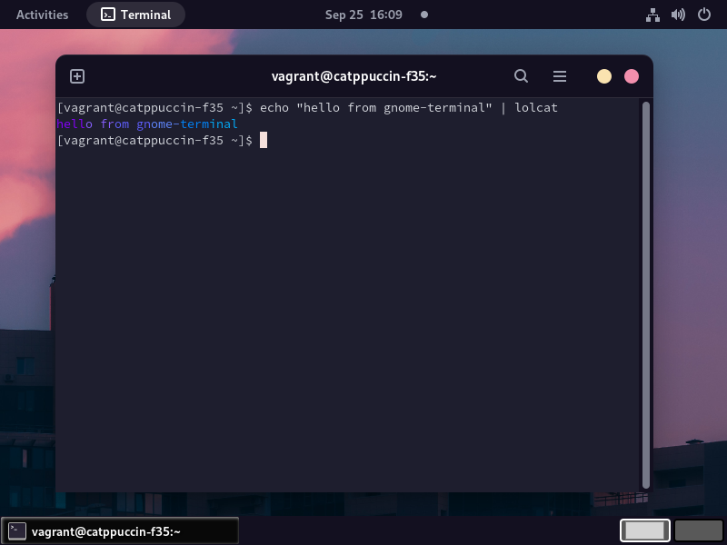

# prettybox-catppuccin
This project provides a provisioned VM to show off various [Catppuccin](https://github.com/catppuccin) ports. See the [Demos](#demos) below.

[Packer](https://www.packer.io/) is used to create the images and [Ansible](https://docs.ansible.com/ansible/latest/index.html) does most of the provisioning. [Vagrant](https://www.vagrantup.com/docs) boxes are produced at the end to make using the VMs easy. To use the VMs, you'll need a hypervisor. This projects aims to support [VirtualBox](https://www.oracle.com/virtualization/virtualbox/) and [QEMU with Libvirt](https://unix.stackexchange.com/questions/486301/whats-the-difference-between-kvm-qemu-and-libvirt).

Basically, each port/tool/app is installed and the Catppuccin theme is applied to it per the theme's instructions. If I use the port in my daily life, the configuration might be opinionated.

The following apps/ports are installed:
- [Alacritty](https://github.com/catppuccin/alacritty)
  - Default Flavor: `Macchiato`
  - Change in `alacritty.yml`
- [Cursors](https://github.com/catppuccin/cursors)
  - Default Flavor: `Macchiato-Mauve`
  - Change in Settings
- [Firefox](https://github.com/catppuccin/firefox)
   - Default Flavor: `Mocha`
   - Use Firefox extension marketplace to change
- Fonts
  - Default: System font
  - Change `ansible/roles/fonts/defaults/main.yml` to pick different fonts
  - Supported fonts: `inter`
- GNOME
  - Install and enable the GNOME desktop
- [Gnome-terminal](https://github.com/catppuccin/gnome-terminal)
  - No choice in flavor
- [GTK](https://github.com/catppuccin/gtk)
  - Default flavor: Purple
  - Change by installing [RPM](https://github.com/braheezy/catppuccin-gtk-rpm) and update in Settings
- [Kitty](https://github.com/catppuccin/kitty)
  - Default flavor: `Macchiato`
  - Change in `kitty.conf`
- [Nvim](https://github.com/catppuccin/nvim)
  - Default flavor: `Macchiato`
  - Managed by `vim-plug` and set in `init.vm`
- [Spotify (handled by Spicetify)](https://github.com/catppuccin/spicetify)
  - No choice in flavor
- [VS Code](https://github.com/catppuccin/vscode)
  - No choice in flavor
- [Wallpapers](https://github.com/catppuccin/wallpapers)
  - Default: `evening-sky.png`
  - Change in Settings

# Usage
For your distro, install the following:
- VirtualBox or QEMU/Libvirt support
- Vagrant
  - If using QEMU/Libvirt, you'll need the [vagrant-libvirt](https://github.com/vagrant-libvirt/vagrant-libvirt) plugin too.

Next, clone this project or download the Vagrantfile.

Finally, use `vagrant` to run the machine for the hypervisor you have installed:

    vagrant up --provider virtualbox
Or

    vagrant up --provider libvirt

# Demos
Here are quick peeks into how some of the ports look. To be honest, some things don't look as good as they might on a host machine and I believe it's either 1) a virtualization penalty in the graphics rendering or 2) Wayland...but then some apps look worse on X11 so you can't seem to win.

- Alacritty
  
  - White border because of Wayland.
- Cursors
  
  - Moving around the window to show off different cursor looks.
- Firefox
  
  - Default Firefox with theme. Side bar really shows it off.
- Gnome Terminal
  
- GTK
  
  - Showing different UI components of system menu
- Kitty
  
- Neovim
  
- VS Code
  
- Wallpapers
  

# Build
For your distro, install the following:
- Packer
- VirtualBox or QEMU/Libvirt support
- Vagrant
  - If using QEMU/Libvirt, you'll need the [vagrant-libvirt](https://github.com/vagrant-libvirt/vagrant-libvirt) plugin too.
- To upload to Vagrant Cloud, a `VAGRANT_CLOUD_TOKEN` is needed. Create an account on Vagrant Cloud to get one.

Once everything is installed and you can run VMs, use `make` to start the build:

    export VAGRANT_CLOUD_TOKEN=<your access token>  # Optional
    make qemu   # Create the VirtualBox machine
    make vbox   # Create the QEMU/Libvirt machine
    make all    # Create all the machines

# Known Issues
- **VirtualBox**
  - I think it's a bug with Fedora but the session in VirtualBox will often freeze and "reset", especially when moving windows around quickly. The behavior seems a bit better if X11 is used instead of Wayland, which can be set at the greeter when logging in.

# Why?
I like automating things and I like Catppuccin. I was already using several ports and had automated the setup of them so I figured I should start throwing them all in single machine.

Port/theme maintainers might like this project as a test platform.

Port/theme users might like this project to test drive ports before installing.

# Future Work
In order to run more ports, there needs to be support for different types of machines:
- More OSes:
  - Debian
  - Windows
  - ???
- More desktops:
  - KDE
  - XFCE
  - ???
